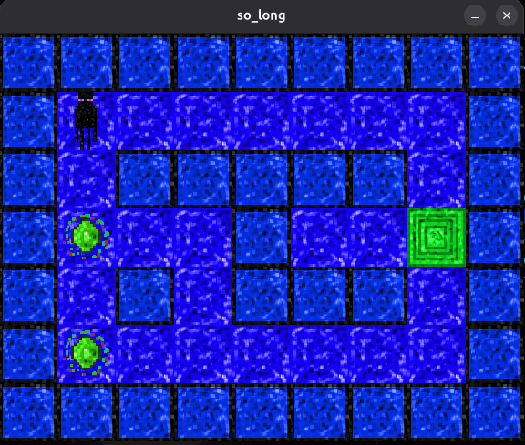

<p align="center">
  
</p>

<h1 align="center">
  <br>
  <a href="https://github.com/SEU_USUARIO/so_long">
    
  </a>
  <br>
  so_long
  <br>
</h1>

<h4 align="center">
  A small 2D game built with MiniLibX in <a href="https://www.c-language.org/" target="_blank">C</a>.
</h4>

<p align="center">
  
  
  
  
  
</p>

<p align="center">
  <a href="#about-the-project">About</a> •
  <a href="#map-validation">Map Validation</a> •
  <a href="#game-concept">Game Concept</a> •
  <a href="#rendering-and-assets">Rendering & Assets</a> •
  <a href="#path-validation-with-flood-fill">Path Validation</a> •
  <a href="#project-structure">Project Structure</a> •
  <a href="#how-to-use">How To Use</a> •
  <a href="#team">Team</a>
</p>

---

<p align="center">
  
</p>

## About the Project

The **so_long** project is one of the first optional projects where cadets at **École 42** have their first real contact with a graphical interface.

Before this project, most of our code lived only inside the Linux terminal, where everything happened through the command line.

With **so_long**, that changes.

This project introduces the student to **MiniLibX**, a small graphics library used to open windows, render images, capture keyboard input, and create a simple 2D game experience.

In my case, I used the version of MiniLibX already available at the **42 São Paulo** campus.

---

## Map Validation

For the game to run, it needs a map with the mandatory extension:

```bash
.ber
````

This map must go through a strong validation process to guarantee that nothing is out of control.

For example, a valid map must have:

* at least **one collectible**
* exactly **one player**
* at least **one exit**
* walls surrounding the map
* no duplicated players
* no impossible collectibles
* no unreachable exit
* no invalid paths that trap the player completely

Example:

```bash
cat map1.ber
111111
1P0001
101101
100001
1C0E01
111111
```

Reading this map:

* `1` = wall
* `0` = floor
* `P` = player
* `C` = collectible
* `E` = exit

This map is fully closed by walls, contains one player, at least one collectible, one exit, and all required elements are reachable.

That makes it a valid map.

---

## Game Concept

After the map passes all validations, the game can finally be rendered.

The main objective of **so_long** is simple:

* move through the map
* collect all collectibles
* reach the exit

At each movement, the terminal displays how many moves were made.

During gameplay, when the player collects an item, the terminal also shows how many collectibles are still missing.

This creates a very simple loop, but one that already introduces important ideas such as:

* graphical rendering
* movement handling
* map logic
* state tracking
* win conditions

---

<html>

</html>

## Rendering and Assets

Each map element has its own image:

* wall
* floor
* player
* exit
* collectible

All of the images in my project were created **pixel by pixel**, using tools such as **Piskel**.

For the game theme, I chose **Enderman from Minecraft**.

Thinking about Enderman and teleportation, I designed the scenario around portals:

* portal-like walls and floor
* an Enderman traveling through different portals
* emerald collectibles
* a final emerald portal as the exit

This gave the project a simple but coherent visual identity.

---

## Path Validation with Flood Fill

One of the most important parts of the project is checking whether the map is actually playable.

For that, I used the **flood fill** algorithm.

The idea is to:

1. clone the map
2. simulate the player's movement through all walkable positions
3. count reachable collectibles
4. verify whether the exit can be reached

This ensures that the player is not placed in an impossible situation.

It also prevents maps where:

* collectibles exist but cannot be collected
* the exit exists but cannot be reached
* the player is effectively trapped

In my implementation, the exit is **not traversable** before the proper condition is satisfied, so it behaves like a blocked area during validation and gameplay logic.

That choice also had to be considered carefully during path analysis.

---

## Project Structure

One very important point in this project was the use of **structs**.

They were fundamental.

Thanks to them, I was able to create a kind of central data system where I could store and control everything the game needed.

That allowed my functions to share a common structure containing the important state of the project, giving me fast access to variables without passing too many parameters everywhere.

This made the code:

* cleaner
* more organized
* easier to scale
* easier to maintain

For me, this was one of the clearest moments where structs stopped being just a syntax feature and became a real design tool.

---

## How To Use

First, compile the project:

```bash
make
```

Then run it with a valid `.ber` map:

```bash
./so_long maps/map1.ber
```

The game window will open, and you can interact with the map using the keyboard controls implemented in the project.

During execution:

* the move counter is shown in the terminal
* collectibles are tracked
* the game only ends successfully when all collectibles are gathered and the exit is reached

---

## Team

**so_long** is an individual project at **École 42**.

It was fully developed by me.

---

## Final Note

For me, **so_long** was a very important transition project.

It was the moment where programming stopped being only terminal logic and started becoming something visual, interactive, and dynamic.

This project taught me much more than how to open a window.

It taught me how to connect:

* validation
* algorithms
* graphics
* game rules
* data organization

into a single working system.

That is what made **so_long** such an important step in my journey.
